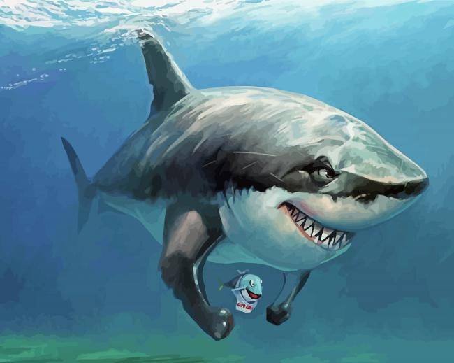
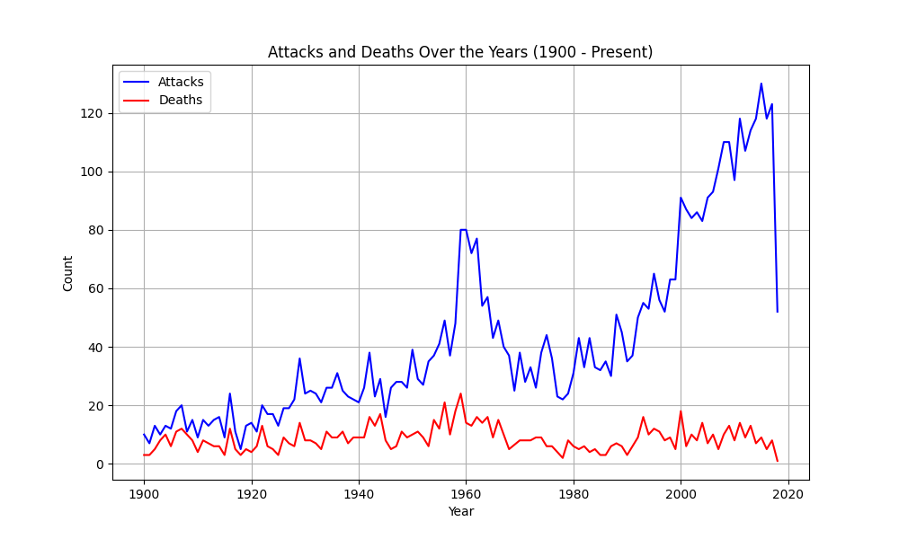
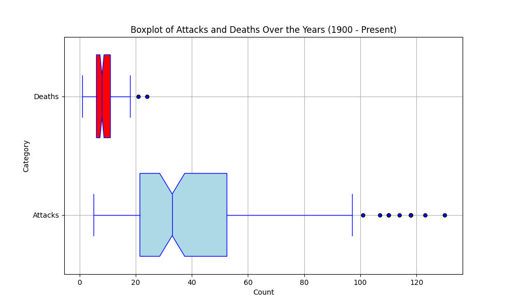
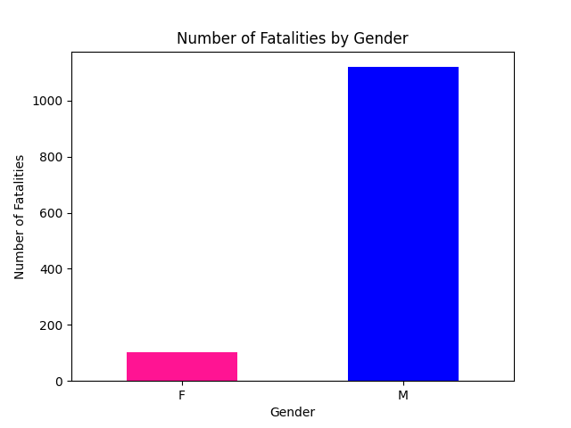
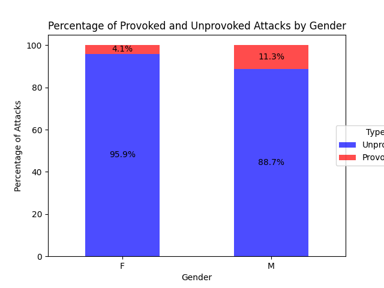
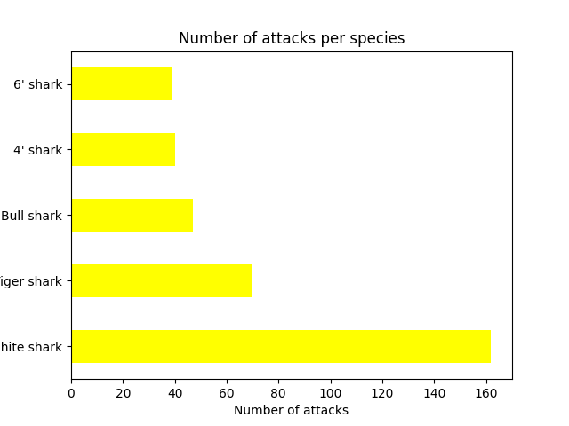
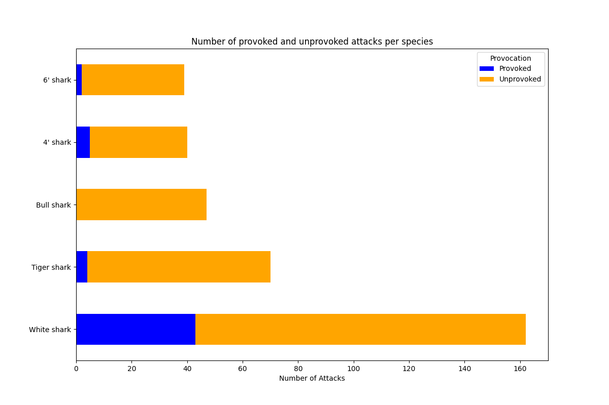

# Shark-Proyect 

En este proyecto se tuvo que estudiar el DataFrame "attacks", sobre ataques de tiburones, utilizando Pandas. Primero se exploró y se limpió el dataset, se plantearon 3 hipótesis, se visualizaron resultados y finalmente se hicieron conclusiones. Para la limpieza se eliminaron duplicados, nulos, columnas que no aportaban información, entre otras cosas. Algo importante respecto a los nulos fue que para cada hipótesis, se realizaron subsets con columnas de interés y se les hizo una copia para poder borrar los nulos ahí mismo y no afectar al DataFrame original.

Las hipótesis utilizadas fueron las siguientes:

Hipótesis 1: Los ataques disminuyeron con el paso de los años

Me basé en que la gente se fue volviendo más consciente con el paso del tiempo y se fueron creando métodos preventivos de ataques de tiburones. Para ver la validez de esta hipótesis se creó un subset del DataFrame, y se realizó una serie de gráficas. La gráfica que mejor resume este análisis se presenta a continuación:

Del gráfico superior se puede ver que no solo no se cumple la hipótesis planteada, sino que el resultado es prácticamente opuesto. Esto puede deberse a diversos factores, entre ellos: 
1) En los años más cercanos al 1800, probablemente se tomaban muchos menos registros de los ataques reales. 
2) Por otro lado, la población mundial viene en aumento, por lo que si el comportamiento de los humanos y el de los tiburones se mantiene relativamente constante en el tiempo, la cantidad de ataques va a aumentar. A su vez, si hay más población hay más turismo, lo cual también lleva a que aumenten los ataques.
3) El hecho de que haya calentamiento global también podría estar afectando.

Se puede observar que la curva roja siempre está comlpetamente por debajo de la azul. Esto tiene sentido ya que las muertes son un caso particular de los ataques (son ataques mortales). Por lo que para ningún año se puede dar que hayan más muertes que ataques. Que se haya cumplido dicha condición, le da cierta credibilidad a los datos del DataFrame. 

Otra observación es que la cantidad de muertes a lo largo del siglo XX tiene una tendencia a ser constante. No tiene valores que estén demasiado desviados de la media. Sin embargo, la cantidad de ataques tiene una tendencia clara a aumentar. Esto indica que con el paso del tiempo, el porcentaje de *ataques letales/ataques generales* por cada año, disminuye en gran medida. Eso nos muestra que la mayoría de los ataques de estas últimas décadas no fueron letales. Yo creo que esto se debe en gran parte a los avances en medicina. El hecho de tener una medicina mucho mas avanzada que la que había en los años más proximos al 1900, hace una gran diferencia. 

Ahora se va a hacer otra representación de la gráfica anterior para ayudar con la visualización.  

El BoxPlot que se encuentra arriba no aporta mucha información nueva al análisis. Pero sí ayuda a visualizar los outliers. Sobre todo los de la gráfica de Deaths. Viendo la gráfica de deaths en la representación de líneas, no queda tan claro si tiene outliers, pero acá en el Boxplot se ven los 2 valores claramente. 

Hipótesis 2: Murieron más hombres que mujeres

 

Claramente se puede ver que la muerte de los hombres supera por un gran margen a la de las mujeres. La cantidad de muertes masculinas es cerca de ser 10 veces más que la cantidad femenina, por lo que se estaría validando la Hipótesis 2. Al parecer, para ver la probabilidad de morir que tiene un individuo estando en zona de riesgo frente a un posible ataque del animal, es claro que la actividad que realiza el individuo tiene una ponderación mucho mayor a la que pueda tener el género. Es decir, un factor muy importante es la actividad que uno realice y no tanto las habilidades físicas del individuo.

Decidí agregar otra gráfica a este análisis que incluya la provocación del humano hacia el animal, separándolo por género nuevamente. Me pareció interesante ya que parte de la hipótesis decía que el hombre en general es más inconsciente/arriesgado que la mujer.

 

Viendo los porcentajes de la gráfica presentada anteriormente, se puede ver que el hombre es menos cuidadoso que la mujer, al menos en este tipo de situaciones acuáticas.

 Hipótesis 3: El tiburón blanco es la especie más agresiva

 
 
 En la representación presentada arriba, se puede ver el número de ataques de las 5 especies que tuvieron valores más altos. El tiburón blanco supera ampliamente a la cantidad de ataques del segundo (Tiger shark), y con un gran margen (más del doble de ataques). Para ver que tan agresivo es el animal, es importante ver nuevamente la relación entre ataques provocados y no provocados, por cada especie. Para ver esto, veamos el siguiente diagrama:

 
 
 Se puede ver que si bien el tiburón blanco tiene un alto porcentaje de ataques no provocados, el total de ataques provocados es superior a los ataques de las otras especies (tanto provocados como no provocados). Por lo que se vuelve a confirmar la hipótesis sobre la agresividad del tiburón blanco.

 
 

 
